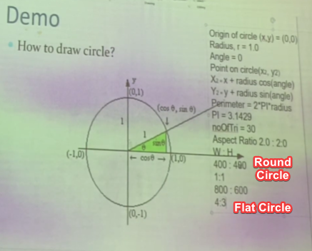

# Calculation

If you forget is cos is for x or y, or sin is for x or y

# Result of Exercise:

### Exercise 1 (Press 1)

### Exercise 2 (Press 2)

### Exercise 3 (Press 3)

### Exercise 4 (Press 4)

### Exercise 5 (Press 5)

### Exercise 6 (Press 7 - 6 is trying new things)

