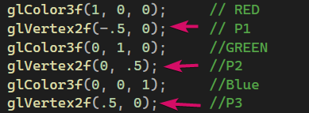

# How to Run

### 1. Create Project

### 2. Install Required Dependencies

### 3. Create Empty Project (C++) Named Practical 1

### 4. Switch to 32 Bits

### 5. Create Source File

### 6. Problem Using Unicode Stirng

### 7. Update Properties (Use Multi-Byte Stirng)
Go to Project properties -> Configuration Properties -> Advanced->Character Set, choose Use Multi-Byte Character Set.

### 8. Update Properties (Select Not Set to Allow Both Console and Window Program)
Go to Project properties -> Configuration Properties -> Linker -> System -> SubSystem, choose "Windows (/SUBSYSTEM:WINDOWS)" and not Console.

### 9. Result

Press Up Key

